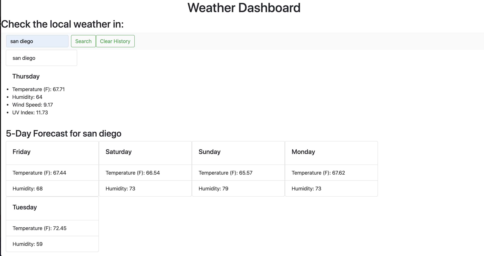

# 06 Server-Side APIs: Weather Dashboard

* Weather Dashboard where you can check the weather
* You can search for a city anywhere in the world
* It'll display the temperature, humidity, wind, and UV index
* Saves your recent searches 
* You can clear your recent searches by clicking one button
* Displays current weather and the following five days

## picture of live website

